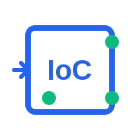

<p align="center">
  
</p>

<h1 align="center">IoC - A Lightweight Dependency Injection Library for Go</h1>

<p align="center">
  <a href="https://github.com/TickleLee/ioc/releases/tag/v0.0.2"></a>
  <a href="https://pkg.go.dev/github.com/TickleLee/ioc"></a>
  <a href="https://github.com/TickleLee/ioc/blob/main/LICENSE"></a>
</p>

> Inspired by Goioc library and uber-go/dig library

## Features
- Singleton mode support
- Prototype mode support
- Dependency injection support
- Type-based dependency injection
- Factory method for object creation
- Automatic type matching for dependencies
- Initialization method support (PostConstruct)
- Manual injection support

## Installation

```bash
go get github.com/ricky/ioc
```

## Usage

### 1. Dependency Injection Process

The typical process for using this IoC container in a Go application is as follows:

1. Register dependencies to the global container in the package's `init()` function
2. Retrieve dependencies during application initialization (e.g., in `Init()` or `New()` functions)

### 2. Code Examples

#### Define Interfaces and Implementations

```go
// Define interface
type UserService interface {
    GetUser(id string) string
}

// Implement interface
type UserServiceImpl struct {
    // Inject other dependencies
    Repo UserRepository `inject:"userRepository"`
}

func (s *UserServiceImpl) GetUser(id string) string {
    return s.Repo.FindById(id)
}

// Define repository interface
type UserRepository interface {
    FindById(id string) string
}

// Implement repository interface
type UserRepositoryImpl struct {}

func (r *UserRepositoryImpl) FindById(id string) string {
    return "User:" + id
}
```

#### Register Dependencies

```go
package service

import "github.com/ricky/ioc/pkg/ioc"

func init() {
    // Register repository implementation as singleton
    ioc.Register("userRepository", &UserRepositoryImpl{}, ioc.Singleton)
    
    // Register service implementation as singleton
    ioc.Register("userService", &UserServiceImpl{}, ioc.Singleton)
    
    // You can also register by type
    ioc.RegisterType("repository", &UserRepositoryImpl{})
    ioc.RegisterType("service", &UserServiceImpl{})
}
```

#### Retrieve Dependencies

```go
func NewUserController() *UserController {
    // Get service from IoC container
    userService := ioc.Get("userService").(UserService)
    
    // Or get by type
    // userService := ioc.GetByType("service", "UserServiceImpl").(UserService)
    
    return &UserController{
        UserService: userService,
    }
}
```

## Singleton Mode vs Prototype Mode

In the IoC container, the scope determines the lifecycle and instantiation method of objects. This library supports two main scopes: Singleton mode and Prototype mode.

### Singleton Mode

Singleton mode ensures that the container creates only one instance throughout the application lifecycle, and all requests for that dependency return the same instance.

**Characteristics:**
- One globally shared instance
- Memory resource conservation
- State shared among all callers

**Suitable scenarios:**
- Stateless services (e.g., utility classes)
- Components that need shared state (e.g., configuration managers)
- Resource-intensive objects (e.g., database connection pools)

**Example code:**

```go
// Register as singleton mode
ioc.Register("configManager", &ConfigManagerImpl{}, ioc.Singleton)

// Get the same instance in different places
config1 := ioc.Get("configManager").(*ConfigManagerImpl)
config2 := ioc.Get("configManager").(*ConfigManagerImpl)

// config1 and config2 point to the same instance
fmt.Println(config1 == config2) // Output: true
```

### Prototype Mode

Prototype mode creates a new instance for each request, with each caller receiving an independent object instance.

**Characteristics:**
- New instance created for each retrieval
- State isolation between instances
- Higher memory usage

**Suitable scenarios:**
- Stateful objects (e.g., session objects)
- Components requiring independent configuration
- Thread-unsafe objects

**Example code:**

```go
// Register as prototype mode
ioc.Register("userSession", &UserSessionImpl{}, ioc.Prototype)

// Get new instances in different places
session1 := ioc.Get("userSession").(*UserSessionImpl)
session2 := ioc.Get("userSession").(*UserSessionImpl)

// session1 and session2 are different instances
fmt.Println(session1 == session2) // Output: false

// Each instance can have independent state
session1.SetUser("user1")
session2.SetUser("user2")
fmt.Println(session1.GetUser()) // Output: user1
fmt.Println(session2.GetUser()) // Output: user2
```

### Choosing the Appropriate Scope

Choosing the appropriate scope is crucial for application performance and correctness:

1. **Singleton mode** is suitable for:
   - Stateless services
   - Configuration information
   - Shared resource managers
   - Cache services

2. **Prototype mode** is suitable for:
   - Request-scoped objects
   - User sessions
   - Objects with specific state
   - Non-thread-safe components

When registering dependencies, choosing the appropriate scope based on component characteristics and usage scenarios can significantly improve application performance and maintainability.

## Using Factory Methods to Create Objects

Sometimes you may need more complex object initialization logic or need to create objects dynamically based on configuration. In such cases, a factory method is a good choice.

```go
// Register factory method
ioc.RegisterFactory("dbConnection", ioc.Singleton, func() (interface{}, error) {
    // Get connection information from configuration
    config := ioc.Get("appConfig").(*Config)
    
    // Create database connection
    db, err := sql.Open(config.DBDriver, config.DBConnString)
    if err != nil {
        return nil, err
    }
    
    // Configure connection pool
    db.SetMaxOpenConns(config.MaxConnections)
    db.SetMaxIdleConns(config.MaxIdleConnections)
    
    return db, nil
})

// Use object created by factory
db := ioc.Get("dbConnection").(*sql.DB)
```

## Interface Design

### Core Interfaces

```go
type Container interface {
    // Register dependency to container
    Register(name string, instance interface{}, scope Scope) error
    
    // Register dependency by type
    RegisterType(typeName string, instance interface{}) error
    
    // Register dependency factory
    RegisterFactory(name string, scope Scope, factory func() (interface{}, error)) error
    
    // Get dependency
    Get(name string) interface{}
    
    // Get dependency by type
    GetByType(typeName string, name string) interface{}
    
    // Safely get dependency, returns error instead of panic
    GetSafe(name string) (interface{}, error)
    
    // Inject dependencies
    Inject(instance interface{}) error
    
    // Initialize container
    Init() error
}

// Scope type
type Scope int

const (
    // Singleton mode - one globally shared instance
    Singleton Scope = iota
    
    // Prototype mode - new instance created for each retrieval
    Prototype
)
```

### Global Functions

For convenience, the library provides global functions that internally use the default container implementation:

```go
// Register dependency
func Register(name string, instance interface{}, scope Scope) error

// Register dependency by type
func RegisterType(typeName string, instance interface{}) error

// Register dependency factory
func RegisterFactory(name string, scope Scope, factory func() (interface{}, error)) error

// Get dependency
func Get(name string) interface{}

// Safely get dependency, returns error instead of panic
func GetSafe(name string) (interface{}, error)

// Get dependency by type
func GetByType(typeName string, name string) interface{}

// Get all registered beans
func GetAll() map[string]*BeanDefinition

// Get all registered bean names
func GetAllNames() []string

// Inject dependencies
func Inject(instance interface{}) error

// Initialize container
func Init() error
```

## Dependency Injection Details

For detailed information about dependency injection, please refer to the [Inject.md](Inject.md) document.

## IoC Container Initialization

Correctly initializing the IoC container is a key step in ensuring the dependency injection system works properly. This section details how to initialize the IoC container in your application.

### Initialization Timing

The IoC container should be initialized in the early stages of application startup, typically in the following locations:

1. **Application main function**: At the beginning of the `main()` function
2. **Application initialization function**: In the application's `Init()` or `Bootstrap()` function
3. **Before server startup**: Before HTTP server or RPC server startup

### Initialization Steps

The complete IoC container initialization process includes the following steps:

1. **Register all dependencies**: Ensure all required dependencies are registered to the container
2. **Initialize container**: Call the `ioc.Init()` function to trigger container initialization
3. **Handle initialization errors**: Check and handle errors that may occur during initialization
4. **Verify key dependencies**: Optionally verify that key dependencies are successfully registered and initialized

### Code Example

#### Basic Initialization

```go
package main

import (
    "fmt"
    "log"
    
    "github.com/TickleLee/ioc/pkg/ioc"
    // Import packages with init() functions to ensure dependencies are registered
    _ "your-app/service"
    _ "your-app/repository"
    _ "your-app/controller"
)

func main() {
    // Initialize IoC container
    if err := ioc.Init(); err != nil {
        log.Fatalf("Failed to initialize IoC container: %v", err)
    }
    
    // After container initialization, you can start using dependencies
    fmt.Println("IoC container initialized successfully")
    
    // Start application services
    startApplication()
}

func startApplication() {
    // Get necessary services from container
    userService := ioc.Get("userService").(UserService)
    // Use services...
}
```

## Complete Example

Check the `examples/example.go` file for a complete usage example.
