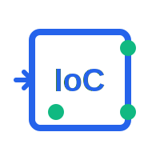

<p align="center">
  
</p>

<h1 align="center">IoC - 一个适用于Go的轻量级的依赖注入库</h1>

<p align="center">
  <a href="https://github.com/TickleLee/ioc/releases/tag/v0.0.2"></a>
  <a href="https://pkg.go.dev/github.com/TickleLee/ioc"></a>
  <a href="https://github.com/TickleLee/ioc/blob/main/LICENSE"></a>
</p>

> 借鉴参考了 Goioc 库和 uber-go/dig 库

## 特性
- 支持单例模式
- 支持多例模式
- 支持依赖注入
- 支持分类型的依赖注入
- 支持工厂方法创建对象
- 支持自动按类型匹配依赖
- 支持初始化方法（PostConstruct）
- 支持手动注入

## 安装

```bash
go get github.com/TickleLee/ioc
```

## 使用方式

### 1. 依赖注入流程

在Go应用中使用本IoC容器的典型流程如下：

1. 在包的`init()`函数中注册依赖到全局容器
2. 在应用初始化时（如`Init()`或`New()`函数中）获取依赖

### 2. 代码示例

#### 定义接口和实现

```go
// 定义接口
type UserService interface {
    GetUser(id string) string
}

// 实现接口
type UserServiceImpl struct {
    // 可以注入其他依赖
    Repo UserRepository `inject:"userRepository"`
}

func (s *UserServiceImpl) GetUser(id string) string {
    return s.Repo.FindById(id)
}

// 定义仓储接口
type UserRepository interface {
    FindById(id string) string
}

// 实现仓储接口
type UserRepositoryImpl struct {}

func (r *UserRepositoryImpl) FindById(id string) string {
    return "User:" + id
}
```

#### 注册依赖

```go
package service

import "github.com/TickleLee/ioc/pkg/ioc"

func init() {
    // 注册仓储实现为单例
    ioc.Register("userRepository", &UserRepositoryImpl{}, ioc.Singleton)
    
    // 注册服务实现为单例
    ioc.Register("userService", &UserServiceImpl{}, ioc.Singleton)
    
    // 也可以按类型注册
    ioc.RegisterType("repository", &UserRepositoryImpl{})
    ioc.RegisterType("service", &UserServiceImpl{})
}
```

#### 获取依赖

```go
func NewUserController() *UserController {
    // 从IoC容器获取服务
    userService := ioc.Get("userService").(UserService)
    
    // 或者按类型获取
    // userService := ioc.GetByType("service", "UserServiceImpl").(UserService)
    
    return &UserController{
        UserService: userService,
    }
}
```

## 单例模式与多例模式详解

在IoC容器中，作用域（Scope）决定了对象的生命周期和实例化方式。本库支持两种主要的作用域：单例模式（Singleton）和多例模式（Prototype）。

### 单例模式（Singleton）

单例模式确保在整个应用生命周期内，容器只创建一个实例，所有对该依赖的请求都返回同一个实例。

**特点：**
- 全局共享一个实例
- 节省内存资源
- 状态在所有调用者之间共享

**适用场景：**
- 无状态的服务（如工具类）
- 需要共享状态的组件（如配置管理器）
- 资源密集型对象（如数据库连接池）

**示例代码：**

```go
// 注册为单例模式
ioc.Register("configManager", &ConfigManagerImpl{}, ioc.Singleton)

// 在不同地方获取，都是同一个实例
config1 := ioc.Get("configManager").(*ConfigManagerImpl)
config2 := ioc.Get("configManager").(*ConfigManagerImpl)

// config1 和 config2 指向同一个实例
fmt.Println(config1 == config2) // 输出: true
```

### 多例模式（Prototype）

多例模式在每次请求时都创建一个新的实例，每个调用者获得独立的对象实例。

**特点：**
- 每次获取创建新实例
- 实例之间状态隔离
- 更高的内存占用

**适用场景：**
- 有状态的对象（如会话对象）
- 需要独立配置的组件
- 线程不安全的对象

**示例代码：**

```go
// 注册为多例模式
ioc.Register("userSession", &UserSessionImpl{}, ioc.Prototype)

// 在不同地方获取，每次都是新实例
session1 := ioc.Get("userSession").(*UserSessionImpl)
session2 := ioc.Get("userSession").(*UserSessionImpl)

// session1 和 session2 是不同的实例
fmt.Println(session1 == session2) // 输出: false

// 每个实例可以有独立的状态
session1.SetUser("user1")
session2.SetUser("user2")
fmt.Println(session1.GetUser()) // 输出: user1
fmt.Println(session2.GetUser()) // 输出: user2
```

### 选择合适的作用域

选择合适的作用域对于应用性能和正确性至关重要：

1. **单例模式**适用于：
   - 无状态服务
   - 配置信息
   - 共享资源管理器
   - 缓存服务

2. **多例模式**适用于：
   - 请求作用域对象
   - 用户会话
   - 包含特定状态的对象
   - 非线程安全的组件

在注册依赖时，根据组件的特性和使用场景选择合适的作用域，可以显著提高应用的性能和可维护性。

## 使用工厂方法创建对象

有时您可能需要更复杂的对象初始化逻辑，或者需要根据配置动态创建对象。在这种情况下，工厂方法是一个很好的选择。

```go
// 注册工厂方法
ioc.RegisterFactory("dbConnection", ioc.Singleton, func() (interface{}, error) {
    // 从配置获取连接信息
    config := ioc.Get("appConfig").(*Config)
    
    // 创建数据库连接
    db, err := sql.Open(config.DBDriver, config.DBConnString)
    if err != nil {
        return nil, err
    }
    
    // 配置连接池
    db.SetMaxOpenConns(config.MaxConnections)
    db.SetMaxIdleConns(config.MaxIdleConnections)
    
    return db, nil
})

// 使用工厂创建的对象
db := ioc.Get("dbConnection").(*sql.DB)
```

## 接口设计

### 核心接口

```go
type Container interface {
    // 注册依赖到容器
    Register(name string, instance interface{}, scope Scope) error
    
    // 按类型注册依赖
    RegisterType(typeName string, instance interface{}) error
    
    // 注册依赖工厂
    RegisterFactory(name string, scope Scope, factory func() (interface{}, error)) error
    
    // 获取依赖
    Get(name string) interface{}
    
    // 按类型获取依赖
    GetByType(typeName string, name string) interface{}
    
    // 安全地获取依赖，返回错误而不是panic
    GetSafe(name string) (interface{}, error)
    
    // 注入依赖
    Inject(instance interface{}) error
    
    // 初始化容器
    Init() error
}

// 作用域类型
type Scope int

const (
    // 单例模式 - 全局共享一个实例
    Singleton Scope = iota
    
    // 多例模式 - 每次获取创建新实例
    Prototype
)
```

### 全局函数

为了方便使用，库提供了全局函数，内部使用默认容器实现：

```go
// 注册依赖
func Register(name string, instance interface{}, scope Scope) error

// 按类型注册依赖
func RegisterType(typeName string, instance interface{}) error

// 注册依赖工厂
func RegisterFactory(name string, scope Scope, factory func() (interface{}, error)) error

// 获取依赖
func Get(name string) interface{}

// 安全地获取依赖，返回错误而不是panic
func GetSafe(name string) (interface{}, error)

// 按类型获取依赖
func GetByType(typeName string, name string) interface{}

// 获取所有注册的bean
func GetAll() map[string]*BeanDefinition

// 获取所有注册的bean名称
func GetAllNames() []string

// 注入依赖
func Inject(instance interface{}) error

// 初始化容器
func Init() error
```

## 依赖注入详解

关于依赖注入的详细信息，请参阅[Inject.md](Inject.md)文档。

## IoC容器初始化详解

正确初始化IoC容器是确保依赖注入系统正常工作的关键步骤。本节将详细说明如何在应用中初始化IoC容器。

### 初始化时机

IoC容器应在应用启动的早期阶段进行初始化，通常在以下位置：

1. **应用主函数**：在`main()`函数的开始部分
2. **应用初始化函数**：在应用的`Init()`或`Bootstrap()`函数中
3. **服务器启动前**：在HTTP服务器或RPC服务器启动之前

### 初始化步骤

完整的IoC容器初始化流程包括以下步骤：

1. **注册所有依赖**：确保所有需要的依赖都已注册到容器中
2. **初始化容器**：调用`ioc.Init()`函数触发容器初始化
3. **处理初始化错误**：检查并处理初始化过程中可能出现的错误
4. **验证关键依赖**：可选地验证关键依赖是否成功注册和初始化

### 代码示例

#### 基本初始化

```go
package main

import (
    "fmt"
    "log"
    
    "github.com/TickleLee/ioc/pkg/ioc"
    // 导入包含init()函数的包，确保依赖被注册
    _ "your-app/service"
    _ "your-app/repository"
    _ "your-app/controller"
)

func main() {
    // 初始化IoC容器
    if err := ioc.Init(); err != nil {
        log.Fatalf("Failed to initialize IoC container: %v", err)
    }
    
    // 容器初始化成功后，可以开始使用依赖
    fmt.Println("IoC container initialized successfully")
    
    // 启动应用服务
    startApplication()
}

func startApplication() {
    // 从容器获取必要的服务
    userService := ioc.Get("userService").(UserService)
    // 使用服务...
}
```

## 完整示例

查看 `examples/example.go` 文件，了解完整的使用示例。